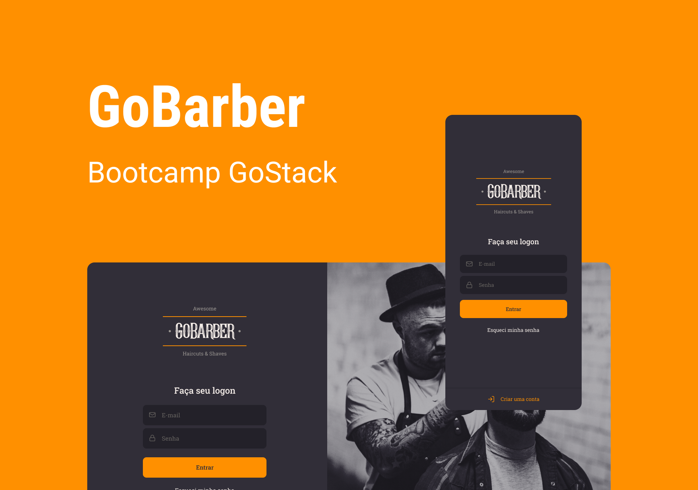

<h1 align="center">
    
</h1>
<p align="center">
  

  
  
  <a href="https://github.com/IgorSasaki/GoBarber/commits/master">
    
  </a>
</p>

<p align="center">
  <a href="#-projeto">Projeto</a>&nbsp;&nbsp;&nbsp;|&nbsp;&nbsp;&nbsp;
  <a href="#rocket-tecnologias">Tecnologias</a>&nbsp;&nbsp;&nbsp;|&nbsp;&nbsp;&nbsp;
  <a href="#rocket-executando">Executando</a>&nbsp;&nbsp;&nbsp;
</p>
<br>

## 💻 Projeto

Esse projeto foi desenvolvido durante o Bootcamp GoStack 11.0 da Rocketseat. Trata-se de um projeto fullstack para uma barbearia ficticia, o projeto consiste na parte frontend(React), mobile(React Native) e backend(NodeJs).

## 🎨 Layout

<p align="center">
    
</p>

Você pode utilizar a seguinte URL para visualizar todas as telas: [Visualizar](https://www.figma.com/file/BXCihtXXh9p37lGsENV614/GoBarber?node-id=34%3A1180)

## :rocket: Tecnologias

Esse projeto foi desenvolvido com as seguintes tecnologias:

- [Typescript](https://www.typescriptlang.org/)
- [Node.js](https://nodejs.org/en/) | [Express](https://expressjs.com/pt-br/)
- [React](https://reactjs.org/) | [React Native](https://reactnative.dev/)
- [Docker](https://www.docker.com/)
- [PostgreSQL](https://www.postgresql.org/) | [TypeORM](https://typeorm.io/)

## :notebook: Executando

### Docker

É preciso ter o [Docker](https://www.docker.com/) instaldo em sua máquina. Feito a instalação, rodar os seguintes comandos:

```bash
$ docker run --name goBarber -e POSTGRES_PASSWORD=docker -p 5432:5432 -d postgres

# Após executar os comandos acima, verificar se as imagens estão rodando no terminal:
$ docker ps

# Caso as imagens estejam paradas/não aparecem no terminal, executar:
$ docker start uuid_database
```

### Backend

```bash
# Entrar na raiz do projeto **/backend** e rodar o comando:
$ yarn install

# Ainda na raiz do projeto, rodar o comando:
$ yarn dev:server
```

### Frontend

```bash
# Entrar na raiz do projeto **/frontend** e rodar o comando:
$ yarn install

# Ainda na raiz do projeto, rodar o comando:
$ yarn start
```

### Mobile

```bash
# Entrar na raiz do projeto **/mobile** e rodar o comando:
$ yarn install

# Caso esteja em macOS
$ cd ios && pod install && cd ..

# Ainda na raiz do projeto, rodar o comando caso esteja no macOS:
$ yarn ios

# Caso esteja no windows rode o comando:
$ yarn android
```

## [](https://insomnia.rest/run?label=&uri=https://github.com/IgorSasaki/GoBarber/blob/master/backend/endpoint_goBarber.json)

Feito com 🧡 por [IgorSasaki](https://www.linkedin.com/in/igor-sasaki/)
